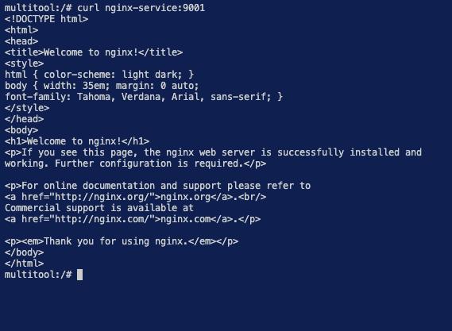
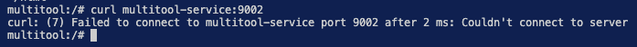
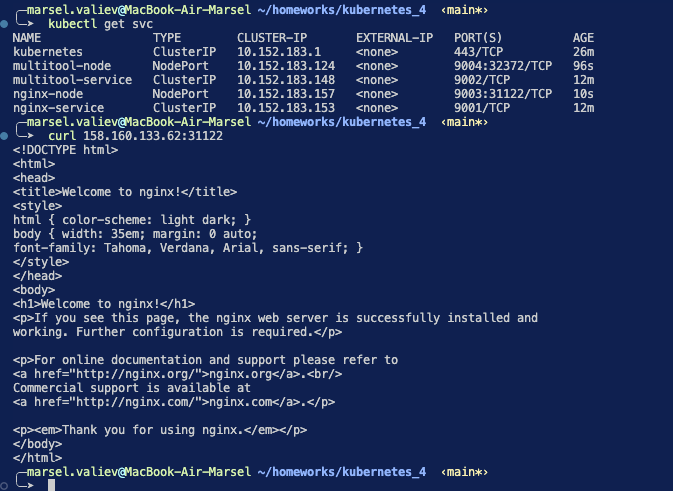

# kubernetes_4

### Задание 1. Создать Deployment и обеспечить доступ к контейнерам приложения по разным портам из другого Pod внутри кластера

### Задание 2. Создать Service и обеспечить доступ к приложениям снаружи кластера

